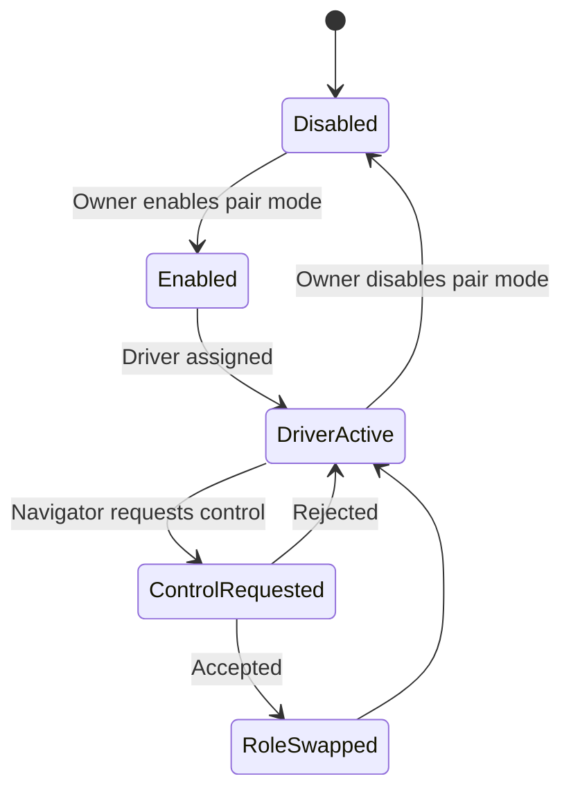
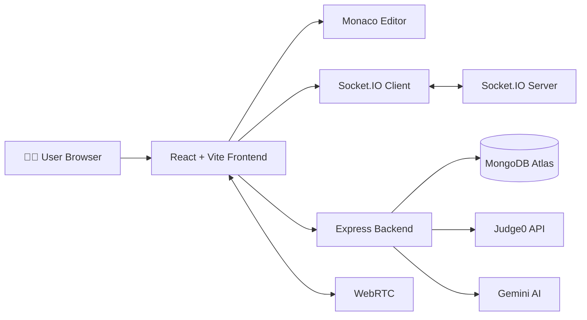

<div align="center">

# 🚀 CollabCode AI

### AI-Powered Real-Time Collaborative Coding Platform

*A modern browser-based collaborative IDE for developers, students, interviewers, and engineering teams.*

<p align="center">

[](https://collab-code-pi.vercel.app)
[](https://react.dev/)
[](https://nodejs.org/)
[](https://mongodb.com/)
[](https://socket.io/)
[](https://judge0.com/)
[](https://ai.google.dev/)

</p>

---

### 🌐 Live Demo

### **https://collab-code-pi.vercel.app**

*A complete collaborative coding ecosystem combining AI assistance, technical interviews, pair programming, and coding contests.*

</div>

---

# 📖 Overview

CollabCode AI is a full-stack collaborative coding platform inspired by **VS Code**, **Replit**, **HackerRank**, **CodePair**, and **LeetCode**.

Instead of switching between multiple tools for coding, interviewing, collaboration, and AI assistance, CollabCode AI brings everything together into a single browser-based workspace.

Whether you're preparing for coding interviews, collaborating with teammates, conducting technical assessments, or hosting coding contests, the platform provides a seamless real-time development experience.

---

# ✨ Key Features

| Category | Features |
|----------|----------|
| 🔐 Authentication | JWT Login, Register, Forgot Password, Reset Password |
| 💻 Collaborative IDE | Monaco Editor, Multi-file Workspace, Live Collaboration |
| ⚡ Code Execution | Judge0 Integration with Multiple Languages |
| 🤖 AI Assistant | Review Code, Explain Code, Fix Bugs |
| 👥 Pair Programming | Driver/Navigator Roles, Control Transfer |
| 🎤 Technical Interviews | Timer, Evaluation, Screen Sharing, Recording |
| 🏆 Coding Contests | Problems, Submissions, Leaderboard |
| 💬 Communication | Real-time Chat & Participants |
| 📁 Workspace | File Explorer, Tabs, Execution History |

---


# 🚀 Why CollabCode AI?

Unlike traditional online coding tools, CollabCode AI combines multiple developer workflows into one integrated platform.

✅ Real-time collaborative coding

✅ AI-powered coding assistance

✅ Multi-language code execution

✅ Technical interview workspace

✅ Pair programming environment

✅ Coding contest platform

✅ Live chat and participant management

All inside a modern browser-based IDE.

---

# 🛠 Tech Stack

### Frontend

- React
- Vite
- Tailwind CSS
- Monaco Editor

### Backend

- Node.js
- Express.js

### Database

- MongoDB Atlas

### Real-Time

- Socket.IO
- WebRTC

### AI

- Google Gemini API

### Code Execution

- Judge0 API

### Deployment

- Vercel
- MongoDB Atlas

---


# 🏗️ System Architecture



---

# 📂 Project Structure

```text
CollabCode-AI
│
├── frontend
│   ├── src
│   │   ├── components
│   │   ├── features
│   │   ├── hooks
│   │   ├── pages
│   │   ├── services
│   │   ├── context
│   │   └── App.jsx
│   │
│   └── package.json
│
├── backend
│   ├── controllers
│   ├── middleware
│   ├── models
│   ├── routes
│   ├── sockets
│   ├── services
│   ├── utils
│   └── server.js
│
└── README.md
```

---

# ⚡ Core Modules

### 🔐 Authentication

- JWT Authentication
- Secure Login & Registration
- Forgot Password
- Reset Password

---

### 💻 Collaborative Editor

- Monaco Editor
- Real-Time Code Synchronization
- Multi-file Workspace
- Live Cursor Presence
- Live Selections
- Auto Save
- Execution History

---

### 🤖 AI Assistant

Powered by **Google Gemini**

- AI Code Review
- Explain Code
- Fix Bugs
- Explain Selected Code

---

### ⚡ Code Execution

Powered by **Judge0**

Supported Languages

- Java
- Python
- JavaScript
- C
- C++

Features

- Custom Input
- Compilation Errors
- Runtime Errors
- Execution Time
- Memory Usage

---

### 🎤 Technical Interview

- Interview Timer
- Notes
- Evaluation
- Screen Sharing
- Recording
- Candidate & Interviewer Roles

---

### 👥 Pair Programming

- Driver / Navigator
- Request Control
- Follow User
- Role Switching

---

### 🏆 Coding Contest

- Contest Creation
- Problem Statements
- Contest Timer
- Real-Time Leaderboard
- Submission History

---

# ⚙️ Installation

## Clone Repository

```bash
git clone https://github.com/YOUR_USERNAME/collabcode-ai.git

cd collabcode-ai
```

---

## Backend Setup

```bash
cd backend

npm install

npm run dev
```

---

## Frontend Setup

```bash
cd frontend

npm install

npm run dev
```

---

# 🔑 Environment Variables

## Backend

```env
PORT=5000

MONGO_URI=

JWT_SECRET=

CLIENT_URL=

GEMINI_API_KEY=

JUDGE0_API_KEY=

JUDGE0_URL=
```

---

## Frontend

```env
VITE_API_URL=

VITE_SOCKET_URL=
```

---

# ▶️ Run Locally

Backend

```bash
npm run dev
```

Frontend

```bash
npm run dev
```

Visit

```text
http://localhost:5173
```

---

# 🌍 Deployment

| Service | Platform |
|----------|----------|
| Frontend | Vercel |
| Backend | Node.js + Express |
| Database | MongoDB Atlas |
| AI | Gemini API |
| Code Execution | Judge0 API |

---

# 📈 Performance Highlights

- ⚡ Real-Time Collaboration using Socket.IO
- ⚡ Optimized React Hooks
- ⚡ Modular Feature-Based Architecture
- ⚡ Responsive IDE Layout
- ⚡ Persistent Workspace State
- ⚡ Production-Ready Deployment
- ⚡ Scalable REST APIs

---
